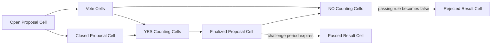

# Hash-Range Counting Cell Voting

This directory is an independent implementation of the Counting Cell voting
design. It intentionally does not share contracts, wire models, or Rust crates
with the SMT-based implementation in `../contracts/`. Both implementations can
therefore be built, tested, deployed, and compared without changing each
other's protocol state.

No CKB node modification or new syscall is required. Every consensus rule in
this implementation runs in ordinary CKB-VM contracts.

## Protocol Flow



1. A Vote Cell authenticates one voter lock and one or more live Nervos DAO
   deposit CellDeps. Its declared amount must equal the deposits' total
   capacity, and every deposit must predate the Proposal Cell.
2. After the voting window closes, the Proposal creator creates YES Counting
   Cells. Each transaction requires an input under the Proposal's recorded
   proposer lock and loads live Vote Cells as CellDeps. The Counting Type Script
   checks their Proposal, direction, lock-hash range, lock uniqueness, amount,
   and count.
3. The Proposal creator consumes one or more non-overlapping, proposer-locked
   YES Counting Cells and changes the Proposal from `Closed` to `Finalized`.
   The Proposal records the verified YES amount and vote count.
4. During the challenge period, a challenger can create NO Counting Cells under
   its own authenticated lock and consume enough non-overlapping NO ranges to
   prove that the configured passing rule is false. All NO Counting Cells in one
   challenge must have the same lock. A successful challenge consumes the
   Proposal and creates a Rejected Result Cell containing the complete Proposal
   bond under that challenger lock.
5. If no successful challenge wins first, the Finalized Proposal can be
   consumed after its relative `since` matures to create a Passed Result Cell.
   The existing Treasury payout path can then consume that Result.

## Directory Layout

- `common/`: fixed wire models and proposal-rule evaluation.
- `contracts/config-type-script/`: immutable Type ID configuration Cell.
- `contracts/vote-type-script/`: authenticates DAO-backed Vote Cells.
- `contracts/counting-type-script/`: verifies a range-bounded vote subtotal.
- `contracts/proposal-type-script/`: closes, finalizes, challenges, settles, or
  vetoes a Proposal.
- `contracts/policy-type-script/`: validates terminal Result Cells and Treasury
  payout authorization.
- `offchain/builder/`: deterministic lock-hash sorting and range batching.
- `offchain/live-e2e/`: isolated real-node proposal, vote, count, finalize, and
  challenge lifecycle.
- `tests/`: CKB-VM lifecycle and adversarial tests.

## Hash Ranges

A Counting Cell stores an inclusive range over the first byte of each voter
lock hash. Vote CellDeps inside the transaction must be ordered by their full
32-byte lock hash and must be unique. When a Proposal aggregates Counting
Cells, their ranges must be strictly ordered and non-overlapping.

The off-chain builder never splits one first-byte bucket across two Counting
Cells. Consequently, a single bucket containing more than
`max_votes_per_counting_cell` unique locks cannot be represented with the
configured batch limit and is rejected by the builder. The protocol has at
most 256 non-overlapping ranges for one direction.

## Security Boundary

Each Counting Cell proves the existence and exact subtotal of its included
live Vote Cells. It does not prove that every eligible vote in the range was
included. Finalization is therefore optimistic:

- the Proposal creator submits enough verified YES votes to produce a candidate
  and authorizes the `Closed` to `Finalized` transition;
- challengers can submit verified NO votes that make the proposal rule fail;
- settlement is delayed by `challenge_period` blocks; and
- the singleton Proposal Cell ensures that only one challenge or settlement
  can win.

The entire capacity of the Proposal Cell is its bond. Creation requires at
least `minimum_proposal_bond`. Its capacity is preserved through Open, Closed,
and Finalized states. Normal settlement returns the complete bond to the
Proposal creator, a successful vote challenge transfers it to the unique owner
of the consumed NO Counting Cells, and a Guardian veto sends it to the
configured burn lock. Transaction fees must come from other inputs.

The approval comparison is strict and uses checked integer cross
multiplication: `yes * 10_000 > (yes + no) * approval_bps`. Consequently, an
approval ratio exactly equal to the configured threshold is rejected. A
challenger only needs enough verified NO weight to make this inequality false;
it does not need to prove the complete NO tally.

This design depends on NO Vote Cells remaining available until the result is
settled and on an interested party submitting a sufficient challenge. The PoC
keeps Vote Cells immutable for that reason. A production design needs an
explicit terminal cleanup mechanism to avoid permanent live-cell growth.

The Vote Type Script can prove that the referenced Proposal is still `Open`,
but an ordinary CKB-VM script cannot enforce an upper bound against the block
currently including the Vote transaction. `end_block` is therefore the earliest
height at which anyone may close the Proposal. The effective voting deadline is
the transaction that consumes the Open Proposal Cell; production operation must
close it promptly at the intended height.

Uniqueness is enforced per voter lock, not per historical DAO outpoint across
opposite directions. A voter creating both YES and NO Vote Cells with the same
lock cannot inflate one direction because ranges cannot overlap within that
direction, but the same voting weight may appear once in the YES certificate
and once in a NO challenge. Defining revote semantics or rejecting this case
requires an additional canonical-vote rule and remains open work.

## Build And Test

```bash
cd impl/counting-contracts
make fmt
make clippy
make test
make size
make live-e2e
```

The ignored cycle benchmark can be run with:

```bash
TOP=$PWD MODE=release \
  cargo test -p counting-contract-tests benchmark_counting_cell_creation \
  -- --ignored --nocapture
```

Measured on 2026-09-03 with release RISC-V contracts:

| Vote CellDeps | CKB-VM cycles | Transaction size |
| ---: | ---: | ---: |
| 1 | 117,069 | 0.500 KB |
| 10 | 245,022 | 0.833 KB |
| 100 | 1,524,762 | 4.163 KB |
| 500 | 7,215,582 | 18.963 KB |
| 1,000 | 14,331,162 | 37.463 KB |

Contract sizes:

| Contract | Stripped size |
| --- | ---: |
| Config Type Script | 56.192 KB |
| Counting Type Script | 60.544 KB |
| Policy Type Script | 65.520 KB |
| Proposal Type Script | 76.136 KB |
| Vote Type Script | 73.272 KB |

For context, the current SMT PoC measures 1,000 ideal votes at approximately
2.080B cycles and 365.728 KB, while this Counting Cell transaction measures
14.331M cycles and 37.463 KB. This is not an equivalent security comparison:
the SMT path commits a state transition and supports historical omission
proofs, whereas this path verifies only live included Vote Cells and relies on
an optimistic NO challenge.

The latest real-node run used `/Users/yukang/code/ckb/target/debug/ckb` and
completed with a Rejected Result after a verified NO challenge. Its report is
at `target/live-e2e/1788440203-52932/report.json`. The challenger subsequently
consumed the Rejected Result and claimed the complete 1,500 CKB Proposal bond.
